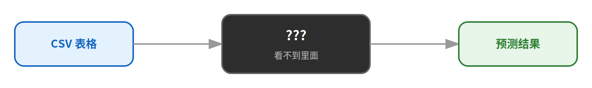
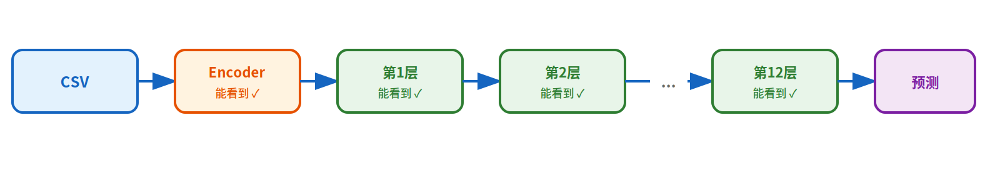
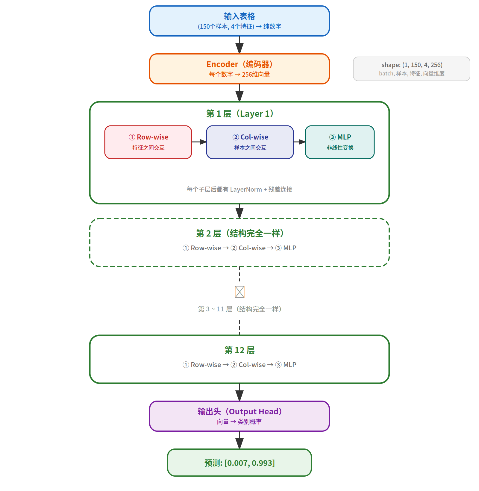
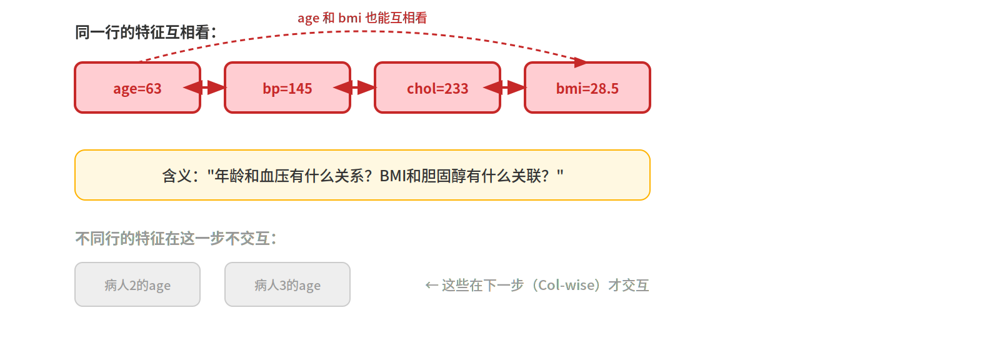
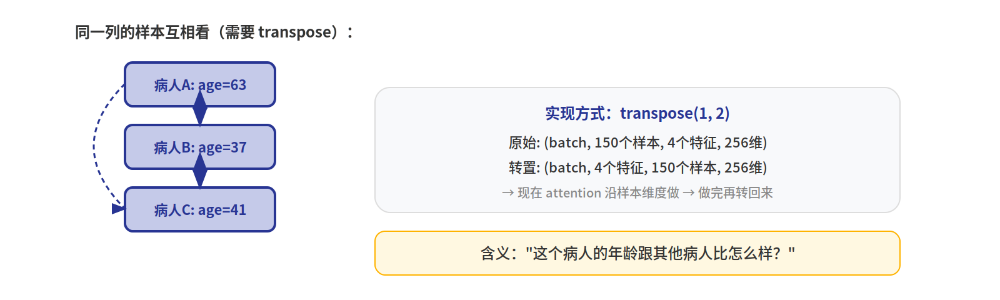
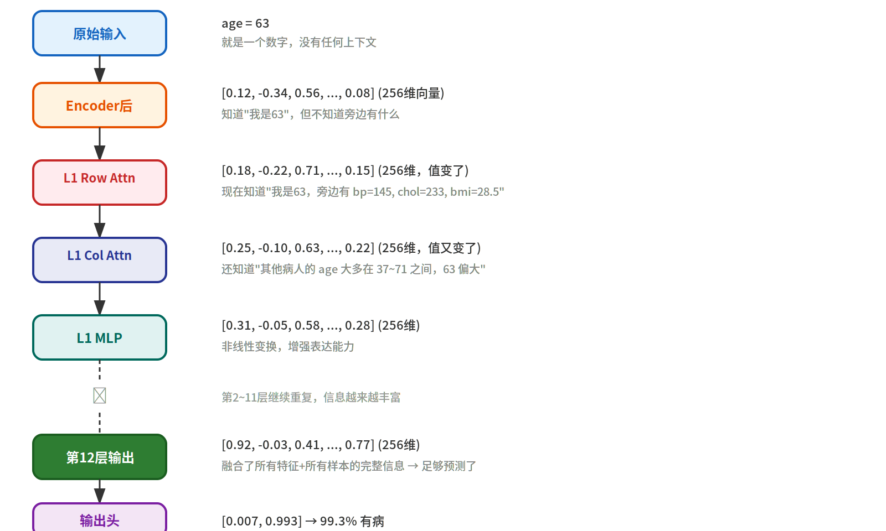
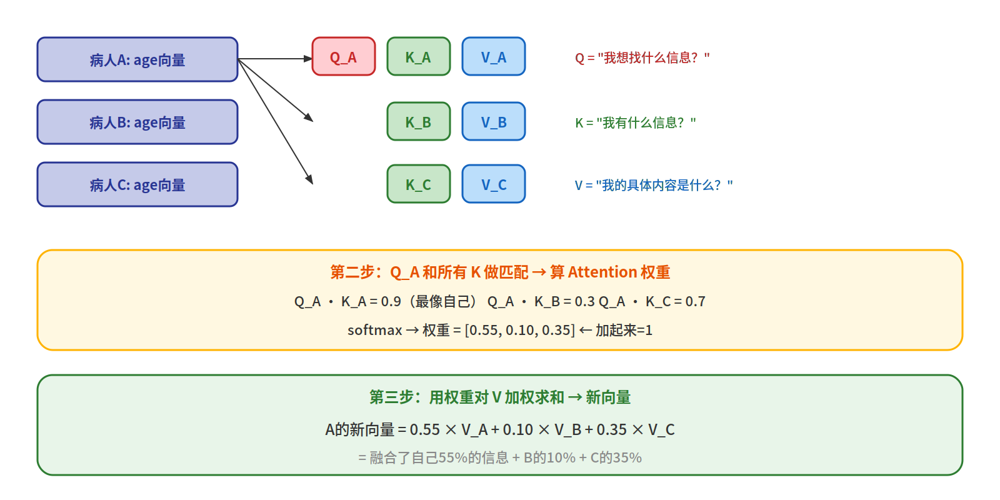
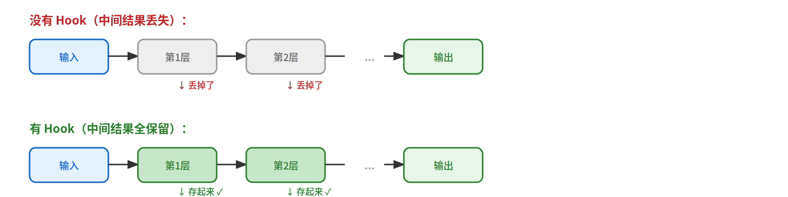
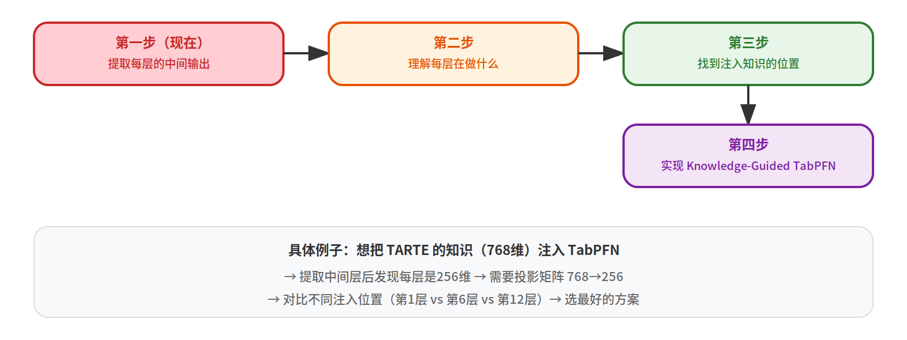

# TabPFNv2 中间层图解

> Haohong Zheng | University of Michigan
>
> 从黑箱到白箱：每一层的输入、输出、含义

---

## 1. 黑箱 vs 白箱

### 现在（黑箱）：只看到输入和输出



### 目标（白箱）：每一步都能看到



**为什么必须这样做？**

以便我们就改进这方法了

| 原因 | 解释 |
|------|------|
| 为了改模型 | Knowledge-Guided TabPFN 需要把知识注入某一层，你得知道注入到哪 |
| 为了定位问题 | 预测错了，错在哪一步？encoder？第5层？输出头？ |
| 为了验证理解 | 能算出中间层 = 真的懂了。不能算 = 只是会调包 |

---

## 2. 完整12层架构



**结构说明：**

- 12层结构**完全一样**，每层都包含 3 个子层
- 子层① Row-wise Attention：特征之间交互
- 子层② Column-wise Attention：样本之间交互
- 子层③ MLP：非线性变换
- 每个子层后都有 LayerNorm + 残差连接
- 总共：12层 × 3子层 = **36步操作**

**虽然结构一样，但每层学到的东西不一样：**

```
第1层之后:  age 向量只知道"我是63，旁边有 bp=145"
第3层之后:  age 向量知道"age+bmi 组合能判断健康风险"
第6层之后:  age 向量知道"整个数据集 age 分布，63 偏大"
第12层之后: age 向量融合了所有特征和所有样本 → 足够预测了
```

---

## 3. 子层①：Row-wise Attention（特征之间）



**含义：** 同一行的不同特征互相做 attention。模型学习"年龄和血压有什么关系"、"BMI和胆固醇有什么关联"。

---

## 4. 子层②：Column-wise Attention（样本之间）



**实现关键：** 通过 `transpose(1, 2)` 交换样本维和特征维。这样同一个 attention 模块就能用在两个方向上。

**含义：** "这个病人的年龄跟其他病人比怎么样？"

---

## 5. 数据如何在每层变化

以 "age=63" 这个 cell 为例，追踪它的向量怎么一步步演化：



**关键观察：** Shape 从头到尾都是 `(1, 150, 4, 256)`，**不会变化**。变化的是向量里的数值——每过一层，数值就更新一次，包含更多信息。

---

## 6. Attention 内部：Q、K、V 是什么



**图书馆类比：**

| 概念 | 类比 |
|------|------|
| Q（Query） | 你去图书馆要查的问题："我想找关于糖尿病的书" |
| K（Key） | 每本书封面上的关键词 |
| V（Value） | 每本书的实际内容 |
| Attention 权重 | 你该花多少时间读每本书 |

---

## 7. 怎么提取中间层：PyTorch Hook



**提取代码：**

```python
import torch
from tabpfn import TabPFNClassifier
from sklearn.datasets import load_iris
from sklearn.model_selection import train_test_split

# 准备数据
X, y = load_iris(return_X_y=True)
X_train, X_test, y_train, y_test = train_test_split(X, y, test_size=0.2, random_state=42)

# 加载模型
model = TabPFNClassifier()
model.fit(X_train, y_train)

# 定义 hook：每当某层算完，把输出存到字典里
saved = {}

def make_hook(name):
    def hook_fn(module, input, output):
        if isinstance(output, torch.Tensor):
            saved[name] = {
                "shape": list(output.shape),
                "min": output.min().item(),
                "max": output.max().item(),
                "mean": output.mean().item(),
                "first_5": output.flatten()[:5].tolist(),
            }
    return hook_fn

# 给每一层装上 hook
hooks = []
for name, module in model.model_.named_modules():
    if name:
        hooks.append(module.register_forward_hook(make_hook(name)))

# 正常跑预测，hook 自动收集中间结果
y_pred = model.predict(X_test)

# 移除 hooks
for h in hooks:
    h.remove()

# 打印每一层的中间结果
for name, info in saved.items():
    print(f"\n层: {name}")
    print(f"  Shape: {info['shape']}")
    print(f"  范围: [{info['min']:.4f}, {info['max']:.4f}]")
    print(f"  均值: {info['mean']:.4f}")
    print(f"  前5个值: {[round(v, 4) for v in info['first_5']]}")
```

---

## 8. 研究路线图



---

## 9. 总结

| 问题 | 回答 |
|------|------|
| 中间层是什么？ | 数据从"原始数字"变成"预测概率"过程中，每一步的向量表示 |
| 12层每层一样吗？ | 结构一样（都是 Row-Attn + Col-Attn + MLP），学到的不一样（越深越抽象） |
| 一层里有几个子层？ | 3个：Row-wise Attention、Column-wise Attention、MLP |
| 总共多少步？ | 12层 × 3子层 = 36步，加上 encoder 和输出头 |
| 怎么提取？ | 用 PyTorch Hook，装一个"监听器"自动保存每层输出 |
| 为什么要提取？ | 为了改模型。不知道中间在算什么，就不知道改哪里 |
| 目前要求的程度？ | 能打印12层每层的输出 shape 和数值 |

**一句话总结：** 看中间变量不是目的，是手段。目的是让你能改这个模型。
