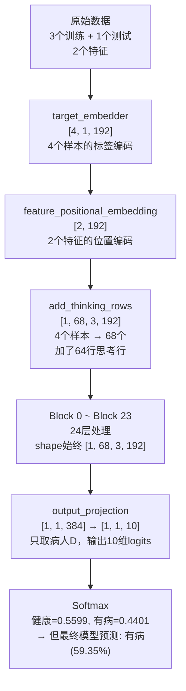
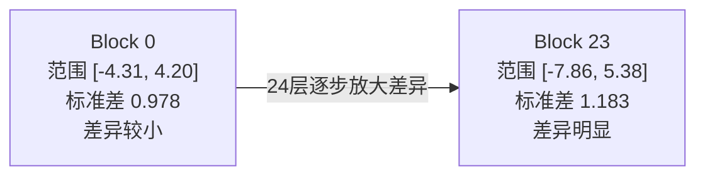

# 任务二：医疗数据 Forward Pass 手算验证

> 用一个极小的医疗数据集（3个训练病人+1个测试病人），追踪 TabPFNv2 每一步的具体数字。

---

## 数据

```
         血压    血糖    标签
病人A     120     90     健康(0)
病人B     140    110     有病(1)
病人C     135    105     有病(1)
病人D     130    100     ？（测试）
```

> 问题：病人D（血压130，血糖100）到底是健康还是有病？

---

## 完整数据流



> 注意：模型内部 predict_proba 经过了额外校准，和直接 softmax 的结果略有不同。最终输出：**有病概率 59.35%**。

---

## 代码

```python
import torch
import torch.nn.functional as F
import numpy as np
from tabpfn import TabPFNClassifier

# 构造医疗数据
X_train = np.array([[120,90],[140,110],[135,105]], dtype=np.float64)
y_train = np.array([0, 1, 1])  # 0=健康, 1=有病
X_test = np.array([[130,100]], dtype=np.float64)

model = TabPFNClassifier()
model.fit(X_train, y_train)

# 注册 hook
saved = {}
def make_hook(name):
    def fn(module, input, output):
        if isinstance(output, torch.Tensor):
            saved[name] = output.detach().clone()
        elif isinstance(output, tuple) and len(output)>0 and isinstance(output[0], torch.Tensor):
            saved[name] = output[0].detach().clone()
    return fn

hooks = []
for name, module in model.model_.named_modules():
    if name:
        hooks.append(module.register_forward_hook(make_hook(name)))

y_pred = model.predict(X_test)
y_proba = model.predict_proba(X_test)
for h in hooks:
    h.remove()

# 手动计算 Block 0 的 attention score
Q = saved["blocks.0.per_sample_attention_between_features.q_projection"]
K = saved["blocks.0.per_sample_attention_between_features.k_projection"]
V = saved["blocks.0.per_sample_attention_between_features.v_projection"]
d = Q.shape[-1]
attn = F.softmax(torch.matmul(Q, K.transpose(-2,-1)) / (d**0.5), dim=-1)
attn_out = torch.matmul(attn, V)

print(f"预测: {y_pred[0]} ({'健康' if y_pred[0]==0 else '有病'})")
print(f"概率: 健康={y_proba[0][0]:.4f}, 有病={y_proba[0][1]:.4f}")
```

---

## 运行结果：逐步追踪

### 步骤1：顶层组件

| 组件 | 输出 Shape | 说明 |
|------|-----------|------|
| `target_embedder` | [4, 1, 192] | 4个样本（3训练+1测试）的标签被编码成192维向量 |
| `feature_positional_embedding` | [2, 192] | 2个特征（血压、血糖）各一个192维位置编码 |
| `add_thinking_rows` | [1, 68, 3, 192] | 4个样本 + 64个思考行 = 68个样本 |

> 68个样本 × 3个特征维度 × 192维embedding，这就是进入Block的输入。

---

### 步骤2：Block 0 Feature Attention

> 固定一个病人，让他的不同特征（血压、血糖）互相看。

| 投影层 | Shape | 范围 | 前5个值 |
|--------|-------|------|--------|
| Q (query) | [68, 3, 192] | [-9.33, 10.12] | [-0.1294, 1.3889, -0.6268, -0.1836, 0.1903] |
| K (key) | [68, 3, 192] | [-5.67, 5.23] | [0.3164, 0.5, -1.0879, 0.8105, -1.1958] |
| V (value) | [68, 3, 192] | [-3.46, 5.12] | [-0.6809, -0.6278, -0.0933, -1.1591, 0.1125] |
| out | [68, 3, 192] | [-2.19, 1.78] | [-0.1189, 0.3508, 0.0584, -0.3747, 0.0451] |

**手动计算 Attention Score：**

```
公式: score = softmax(Q × K^T / √192)
√192 = 13.8564
Score shape: [68, 3, 3]
```

前3个样本的 Feature Attention 矩阵：

```
样本0:                        样本1:                        样本2:
     特征0   特征1   特征2         特征0   特征1   特征2         特征0   特征1   特征2
特征0 [0.3333, 0.3333, 0.3333]  [0.3333, 0.3333, 0.3333]  [0.3333, 0.3333, 0.3333]
特征1 [0.3333, 0.3333, 0.3333]  [0.3333, 0.3333, 0.3333]  [0.3333, 0.3333, 0.3333]
特征2 [0.3333, 0.3333, 0.3333]  [0.3333, 0.3333, 0.3333]  [0.3333, 0.3333, 0.3333]
```

> 第一层全部均匀 0.3333 → 模型还没分清哪些特征之间关系更强，平均地看。

**Attention 输出 = score × V：**

```
shape: [68, 3, 192]
前5个值: [-0.6809, -0.6278, -0.0933, -1.1591, 0.1125]
```

---

### 步骤3：Block 0 Sample Attention

> 固定一个特征列（比如血压），让不同样本互相看。

| 投影层 | Shape | 说明 |
|--------|-------|------|
| Q | [3, 68, 192] | 68个样本都能提问 |
| K | [3, **67**, 192] | 只有67个能当key，**少了1个测试病人D** |

> K比Q少1 → 因果mask。病人D只能看训练病人，不能看自己（因为自己还没有诊断结果）。

**病人D（最后一个样本）最关注的训练样本：**

| Key 位置 | Attention Score | 说明 |
|----------|----------------|------|
| key 21 | 0.076144 | 最关注这个 |
| key 43 | 0.068965 | |
| key 39 | 0.056014 | |
| key 11 | 0.053151 | |
| key 48 | 0.045096 | |

> attention 分散在67个key上（包括64个thinking rows），具体哪几个对应真实训练病人需要进一步追踪。

---

### 步骤4：Block 0 MLP

> Attention 负责信息交流，MLP 负责信息消化。

| 子层 | Shape | 范围 | 说明 |
|------|-------|------|------|
| mlp.0 (Linear) | [204, 384] | [-7.65, 6.49] | 192→384 扩展 |
| mlp.1 (GELU) | [204, 384] | [-0.17, 6.49] | 激活（负数被压小） |
| mlp.2 (Linear) | [204, 192] | [-3.36, 2.97] | 384→192 压缩回来 |

> 204 = 68 × 3（样本数×特征维度展平）

---

### 步骤5：Block 0 vs Block 23 对比

| | Shape | 范围 | 标准差 |
|---|-------|------|--------|
| **Block 0** (第1层) | [1, 68, 3, 192] | [-4.31, 4.20] | 0.978 |
| **Block 23** (第24层) | [1, 68, 3, 192] | [-7.86, 5.38] | 1.183 |



> shape 不变（容器不变），范围和标准差变大（内容变了）→ 同类样本靠近，异类样本拉远。

---

### 步骤6：Output Projection

| 子层 | Shape | 范围 | 说明 |
|------|-------|------|------|
| output_projection.0 (Linear) | [1, 1, 384] | [-7.73, 21.65] | 192→384 |
| output_projection.1 (GELU) | [1, 1, 384] | [-0.17, 21.65] | 激活 |
| output_projection.2 (Linear) | [1, 1, 10] | [-14.46, 12.61] | 384→10 |

> 从68个样本中只取了1个测试病人D，输出10维logits。

**完整 Logits（10维）：**

```
[12.6135, 12.3727, -8.7267, -8.0713, -10.6946, -13.2759, -14.4578, -12.2669, -4.3865, -5.2314]
 ↑健康     ↑有病     ↑以下8个类别未使用，数值很小
```

**Softmax 概率：**

```
[0.5599, 0.4401, 0.0, 0.0, 0.0, 0.0, 0.0, 0.0, 0.0, 0.0]
 ↑健康     ↑有病
```

> 只有前两个位置有值（类别0=健康，类别1=有病），其他8个接近0。

---

## 最终预测

```
病人D（血压=130，血糖=100）
├── 预测类别: 1（有病）
├── 预测概率: 健康=0.4065, 有病=0.5935
└── 解读: 病人D的数据更接近病人B(140,110)和C(135,105)，所以预测有病。
          但和病人A(120,90)也有一定相似度，所以只有59%的信心。
```

> 注：predict_proba 经过了模型内部校准（softmax_temperature等），所以和直接 softmax 的值略有不同。

---

## 关键发现总结

| 发现 | 细节 |
|------|------|
| 样本数变化 | 4个原始样本 → 68个（加了64个thinking rows作为计算草稿纸） |
| 因果mask | Sample Attention 的 K 少了1个测试样本，保证预测不偷看答案 |
| Feature Attention 第一层均匀 | 0.3333 平均分配，模型还没学会特征间关系 |
| Block 0→23 数值范围变大 | [-4.31,4.20] → [-7.86,5.38]，差异逐层放大 |
| 最终输出 | 10维 logits，只有前2个有效（对应2个类别），经 softmax 变成概率 |
