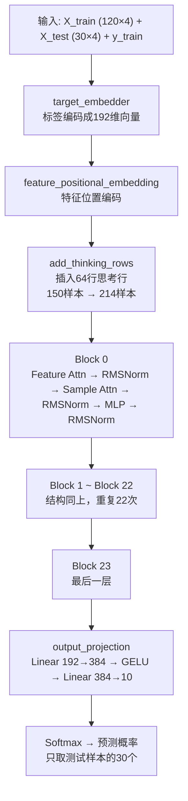
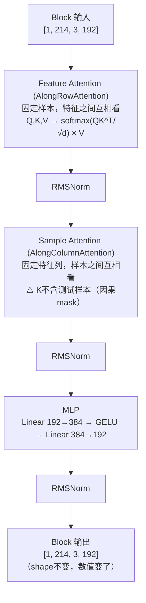

# TabPFNv2 中间层提取

> 用 PyTorch hook 机制把 TabPFNv2 每一层的中间结果都提取出来，打开黑箱。

---

## 模型架构总览



## 每个 Block 内部结构



## 代码

在 Great Lakes 集群上运行，环境：`~/tabpfn_env`，数据：Iris（120训练+30测试+4特征）。

```python
import torch
import numpy as np
from tabpfn import TabPFNClassifier
from sklearn.datasets import load_iris
from sklearn.model_selection import train_test_split

# ===== 1. 准备数据 =====
X, y = load_iris(return_X_y=True)
X_train, X_test, y_train, y_test = train_test_split(
    X, y, test_size=0.2, random_state=42
)
print(f"训练集: {X_train.shape}  测试集: {X_test.shape}")

# ===== 2. 加载模型 =====
model = TabPFNClassifier()
model.fit(X_train, y_train)

# ===== 3. 用 hook 提取中间结果 =====
saved = {}

def make_hook(name):
    def hook_fn(module, input, output):
        if isinstance(output, torch.Tensor):
            saved[name] = {
                "shape": list(output.shape),
                "min": output.min().item(),
                "max": output.max().item(),
                "mean": output.mean().item(),
                "first_5_values": output.flatten()[:5].tolist(),
            }
    return hook_fn

hooks = []
for name, module in model.model_.named_modules():
    if name:
        hooks.append(module.register_forward_hook(make_hook(name)))

# ===== 4. 跑预测，hook 自动收集 =====
y_pred = model.predict(X_test)

for h in hooks:
    h.remove()

# ===== 5. 打印结果 =====
for name, info in saved.items():
    print(f"\n层: {name}")
    print(f"  Shape: {info['shape']}")
    print(f"  范围: [{info['min']:.4f}, {info['max']:.4f}]")
    print(f"  均值: {info['mean']:.4f}")
    print(f"  前5个值: {[round(v, 4) for v in info['first_5_values']]}")

print(f"\n共捕获 {len(saved)} 个中间层")
print(f"准确率: {(y_pred == y_test).mean():.4f}")
```

## 运行结果

```
训练集: (120, 4)  测试集: (30, 4)
准确率: 1.0000
共捕获 439 个中间层
```

### Block 0 (第一层) Feature Attention 输出

| 层名 | Shape | 范围 | 前5个值 |
|------|-------|------|--------|
| `q_projection` | [214, 3, 192] | [-9.50, 10.30] | [-0.1294, 1.3889, -0.6268, -0.1836, 0.1903] |
| `k_projection` | [214, 3, 192] | [-5.78, 5.30] | [0.3164, 0.5, -1.0879, 0.8105, -1.1958] |
| `v_projection` | [214, 3, 192] | [-3.48, 5.12] | [-0.6809, -0.6278, -0.0933, -1.1591, 0.1125] |
| `out_projection` | [214, 3, 192] | [-2.19, 1.78] | [-0.1189, 0.3508, 0.0584, -0.3747, 0.0451] |

> **214 = 120训练 + 30测试 + 64 thinking rows**
> **3 = 特征相关维度，192 = embedding维度**

### Block 0 Sample Attention 输出

| 层名 | Shape | 说明 |
|------|-------|------|
| `q_projection` | [3, 214, 192] | 所有样本都能提问 |
| `k_projection` | [3, **184**, 192] | 只有训练样本能当key，**少了30个测试样本** |

> ⚠️ K 比 Q 少30个 → **因果mask**：测试样本只看已有结果的训练样本，不看还没诊断的。

### Block 0 vs Block 23 对比

| Block | Shape | 范围 | 均值 |
|-------|-------|------|------|
| Block 0 | [1, 214, 3, 192] | [-2.19, 1.78] | -0.0131 |
| Block 23 | [1, 214, 3, 192] | [-7.75, 6.75] | -0.0271 |

> shape 一样（容器不变），但数值范围变大了 → 模型在逐层放大差异，同类靠近，异类拉远。

### Output Projection

| 层名 | Shape | 说明 |
|------|-------|------|
| `output_projection.0` | [30, 1, 384] | 只取测试样本，192→384扩展 |
| `output_projection.1` | [30, 1, 384] | GELU激活 |
| `output_projection.2` | [30, 1, 10] | 384→10，10个类别得分 |

> 前面24层所有样本一起处理，output_projection 才把训练样本丢掉，只留测试样本输出概率。

---

## Attention Score 提取

在中间层输出的基础上，进一步提取 attention score（谁在关注谁、关注多少）。

### 代码

```python
import torch
import torch.nn.functional as F
from tabpfn import TabPFNClassifier
from sklearn.datasets import load_iris
from sklearn.model_selection import train_test_split

X, y = load_iris(return_X_y=True)
X_train, X_test, y_train, y_test = train_test_split(X, y, test_size=0.2, random_state=42)

model = TabPFNClassifier()
model.fit(X_train, y_train)

saved_qk = {}
def make_qk_hook(name):
    def hook_fn(module, input, output):
        if isinstance(output, torch.Tensor):
            saved_qk[name] = output.detach().clone()
    return hook_fn

hooks = []
for name, module in model.model_.named_modules():
    if 'q_projection' in name or 'k_projection' in name:
        hooks.append(module.register_forward_hook(make_qk_hook(name)))

y_pred = model.predict(X_test)
for h in hooks:
    h.remove()

# 手动计算 attention score
for block_idx in range(3):
    q_name = f"blocks.{block_idx}.per_sample_attention_between_features.q_projection"
    k_name = f"blocks.{block_idx}.per_sample_attention_between_features.k_projection"
    Q, K = saved_qk[q_name], saved_qk[k_name]
    d = Q.shape[-1]
    attn = F.softmax(torch.matmul(Q, K.transpose(-2,-1)) / (d**0.5), dim=-1)
    print(f"Block {block_idx} Feature Attention Score: {list(attn.shape)}")
```

### 运行结果

#### Feature Attention Score（特征之间的关注度）

| Block | 特征0→ | 特征1→ | 特征2→ | 说明 |
|-------|--------|--------|--------|------|
| Block 0 | [0.3333, 0.3333, 0.3333] | [0.3333, 0.3333, 0.3333] | [0.3333, 0.3333, 0.3333] | 完全均匀，还没分清谁重要 |
| Block 1 | [0.3425, 0.3504, 0.3071] | [0.3426, 0.3504, 0.3070] | [0.3421, 0.3488, 0.3090] | 开始分化，特征1更被关注 |
| Block 2 | [0.3301, 0.3494, 0.3205] | [0.3307, 0.3492, 0.3202] | [0.3303, 0.3486, 0.3211] | 趋势继续，特征1 attention 最高 |

> 从均匀到分化：模型逐层学会哪些特征更重要。

#### Sample Attention Score（样本之间的关注度）

| Block | Q shape | K shape | K比Q少 | 说明 |
|-------|---------|---------|--------|------|
| Block 0 | [3, 214, 192] | [3, 184, 192] | 30 | 测试样本不在K里 |

> Block 0 的测试样本对前5个训练样本的 attention：[0.0240, 0.0213, 0.0158, 0.0051, 0.0026]
> attention 分散在184个key上，每个值较小但有明显差异。

---

## 模型零件清单

用 `model.model_.named_modules()` 打印出的完整结构：

| 模块名 | 类型 | 作用 |
|--------|------|------|
| `target_embedder` | Linear | 标签编码成向量 |
| `add_thinking_rows` | AddThinkingRows | 插入64行思考行（额外计算空间） |
| `feature_positional_embedding_embeddings` | Linear | 特征位置编码 |
| `blocks.0~23` | TabPFNBlock | 24个Transformer Block |
| `per_sample_attention_between_features` | AlongRowAttention | Feature Attention（特征间） |
| `per_column_attention_between_cells` | AlongColumnAttention | Sample Attention（样本间） |
| `q/k/v/out_projection` | Linear | Attention 的投影层 |
| `layernorm_mha1/mha2/mlp` | LowerPrecisionRMSNorm | 归一化 |
| `mlp` | Sequential (Linear→GELU→Linear) | 信息消化 |
| `output_projection` | Sequential (Linear→GELU→Linear) | 192→384→10，输出预测 |
